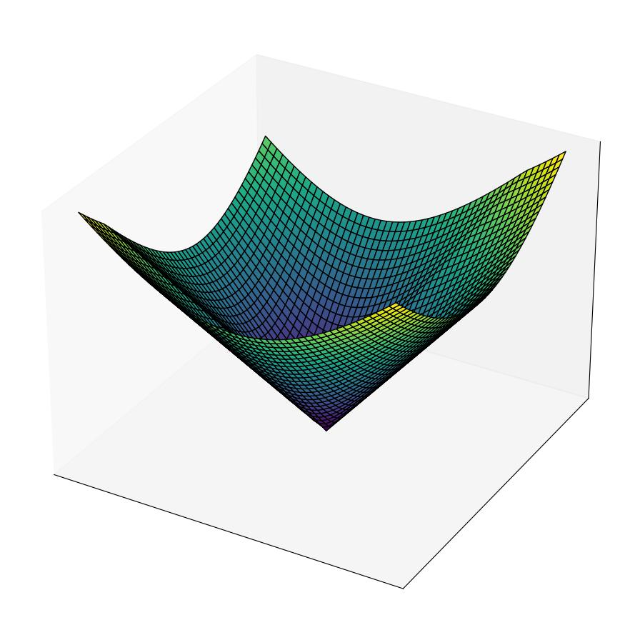
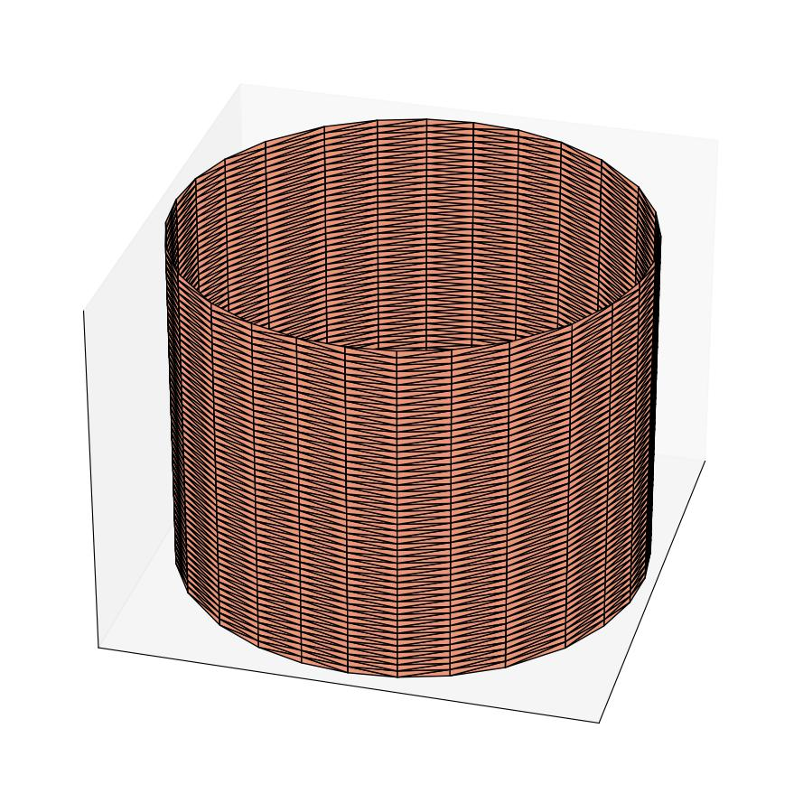

### Initial Conditions 

At issue are co-dimension one implicitly defined surfaces on $\mathbb{R}^n$ which represent the interface of a flow, or function e.g. $f(x)$. These interfaces are more often than not the isocontours of some function. This representation is attractive since it requires less number of points to represent a function than explicit forms. For example, an implicitly constructed zero isocontour (or zero levelset)  of a reachability optimal control problem is equivalent to its _safety set_ or _backward reachable tube_; and for a _differential game_, it is the _boundary of the useable part_ of the _barrier surface_ between the _capture_ and _escape zones_ for all trajectories that emanate from a system.


By implicitly representing functions $f(x)$ for points $x$ e.g. in $\mathbb{R}^n$, we do not explicitly describe but rather imply the existence of $f$. This representation is attractive since it requires less number of points to represent a function than explicit forms. Let us describe the representation of data we employ in what follows.

#### Implicit Surfaces Representation

For an implicit surface representation of $f(x)$, we treat the coordinates as functional arguments instead of functional values using a fixed level set of continuous function $V: \mathbb{R}^n \rightarrow \mathbb{R}$. We use signed distance functions to represent moving fronts throughout. When the signed distance function is not numerically possible, we describe where the implicit surface representations are smeared out in every routines' documentation. 

The query points for moving interfaces are grid point sets of the computational domain  described by implicit geometric primitives such as spheres, cylinders, ellipsoids and even polyhedrons such as icosahedrons.

Suppose that the zero levelset of an implicit surface $V(x,t)$ is defined as $\Gamma = \{x: V(x)=0\}$ on a grid $G\in \mathbb{R}^n$. Our representation of $\Gamma$ on $G$ generalizes a row-major layout. For an ellipsoid constructed from every point on a three-dimensional Cartesian grid, we have

```python
    e = (g.xs[0])**2 // ellipsoid nodal points constructed from the nodal points of a grid g
    e += 4.0*(g.xs[1])**2
    if g.dim==3:
        data += (9.0*(grid.xs[2])**2)
    e -= radius // radius=major axis of ellipsoid
```

Once the grid is constructed as above, `e` can be visualized with one our `Visualization` classes. This is described in the [README](/../Visualization/README.md) within the [Visualization](../Visualization/) folder.

#### Calculus on Implicit Functions

It very often becomes useful and necessary to carry out mathematical operations on implicitly constructed functions. Boolean operations are very useful conterparts for stacking signed distance representation of functions together, subtracting them from one another, or carrying out other operations. 

For the operations implemented in this section, we have closely followed Osher and Fedkiw's layout in 

```tex 
    @book{Osher,
    author = {Osher, Stanley and Fedkiw, Ronald},
    title = {{Level Set Methods and Dynamic Implicit Surfaces}},
    url = {http://graphics.stanford.edu/$\sim$fedkiw}
}

```

In the [shape_ops file](/shape_ops.py), these operations are implemented. 

+ For example, if we desire to unite two separate interfaces defined along the nodal points of a grid constructed on $\mathbb{R}^n$, say a sphere and a rectangle, we would carry out an element-wise minimum of every point belonging to the two or more interfaces. This is what we do in `shapeUnion`. 

+ If we desire to intersect the two interfaces, we would carry out an element-wise maximum of every nodal point belonging to the two or more interfaces. We implement this in the routine `shapeIntersect`. 

+ Very often, we want to just subtract an interface' geometry from that of another. In this case, we negate the nodal points belong to the interface which we want to subtract, and then follow this operation with an element-wise maximum of all shapes. We implement this operation in `shapeDifference`.

+ A last common operation on implicit interfaces is the need to find the complement set of an interface. In this instance, we simply negate the original function. This is in `shapeComplement`.

Some examples of some operations on using this subpackage are illustrated below.


#### **Geometry of Implicit Surfaces**

+ Implicit representation of 2D geometric primitives on a [grid](../Grids) in 2 dimensions are herewith put forward. We construct surfaces implicitly on 2D grid nodes by performing elementary geometric operations between the representation of specific geometric primitives and grid nodal points. All the codes for reproducing these geometries are available in [test_mesh_2d_only.py](../Tests/test_mesh_2d_only.py). Jupyter notebook files are available in [init_conds.ipynb](../Notes/init_conds.ipynb).


<div align="center">


</div>

+ <center><b>Left to right: A cylinder, a rectangle, and a sphere.</b></center>


<div align="center">



</div>

+ <center><b>Left to right: Union of two spatially separated rectangles on a grid; union of two spheres; and union of a sphere and a rectangle.</b></center>

+ Implicit representation of 3D geometric primitives on a [grid](/Grids) in 3 dimensions are herewith put forward. We construct surfaces implicitly on 3D grid nodes by performing elementary geometric operations between the representation of specific geometric primitives and grid nodal points. All the codes for reproducing these geometries are available in [test_mesh_3d.py](Tests/test_mesh_3d_only.py).


<div align="center">


</div>

- <center><b>Left to right: A cylinder, and a sphere.</b></center>

<div align="center">


</div>

- <center><b>Left to right: Union of a sphere and cylinder, and intersection of a sphere and cylinder.</b></center>

