### **LevelSetsPy Library**

This codebase implements GPU-accelerated software package for solving initial value  hyperbolic partial differential equations, particularly of the evolution form of Cauchy-type Hamilton-Jacobi (HJ) equations. These HJ equations are increasingly attracting attention in the control community for analyzing reachability problems in robotics, transport, biology and other problem domains of late.  We focus on safety-critical analysis of automated systems in optimal control and reachability settings. This software package allows easy portability and extensibility to modern libraries for the analyses of safety-critical algorithms for (reinforcement) learning, control, robotics, transport, and flow problems among others.


For the technical details on the theory behind this work, please see this paper:

```
@article{LevPy,
title   = {A GPU-Accelerated Python Software Package for HJ Reachability Analysis and Level Set Evolutions.},
publisher={Molu, Lekan},
author  = {Molu, Lekan},
howpublished = {\url{https://github.com/robotsorcerer/LevelSetPy}},
note = {Accessed March 31, 2023}
year    = {2023},
}
```

### **Installation and Prerequisites**

### **Dependencies** 

+ It's best to create a virtual or conda environment in python 3.9+.

+ All the dependencies listed below are installable via: `pip install .`

| Dependency      | Dependency      | Dependency      | 
| :--:     | :---:               | :---:               | 
| [Numpy](https://numpy.org/)  | [Scipy](https://scipy.org/)  | [Cupy](https://cupy.dev/) |
| [Absl-py](https://abseil.io/docs/python/quickstart)   | [Scikit-image](https://scikit-image.org/) | [Matplotlib](https://matplotlib.org/)     | 

**Note**: The user should elect to install a cupy version that matches the version of their CUDA installation. Cupy is commented out in the [requirements.txt](requirements.txt) file. Please follow the directions on the [cupy install page](https://docs.cupy.dev/en/stable/install.html).

### **Build and Install**

Be sure to activate your `conda` or `virtualven` environment first e.g. if your environment is named `py39`:

```bash
	conda activate py39
```

Then install to the activated environment as follows

```bash
python setup.py build --build-lib=/path/to/your-desired/build
pip install -e . 
```


A separate `README.md` file is left in the respective folders to guide the reader and user on how to use each subpackage.

### **Examples**

#### **Initial Value Problems (IVP)**

+ Make a 2D Grid 

```python

from levelsetpy.grids import *
import matplotlib.pyplot as plt
from levelsetpy.utilities import *
from levelsetpy.boundarycondition import *
from levelsetpy.visualization import *
from math import pi
from levelsetpy.initialconditions import *


# ### A Basic 2-D Grid and a signed distance function cylinder

delay = 1
block=False
fontdict = {'fontsize':12, 'fontweight':'bold'}

from math import pi
gridMin = np.array([[0,0]])
gridMax = np.array([[5, 5]])
N = 20 *np.ones((2,1)).astype(np.int64)
g = createGrid(gridMin, gridMax, N, low_mem=False, process=True)

savedict = dict(save=True, savename='2d_grid.jpg', savepath=join("..", "jpeg_dumps"))
viz = Visualizer(winsize=(8, 5), block=block, savedict=savedict)
viz.visGrid([g], g.dim, title='Simple 2D Grid')
```

 - Spheres on a 2D grid: a single sphere, two spheres, union of two spheres, and difference of a sphere and a rectangle.

<div align="center">
 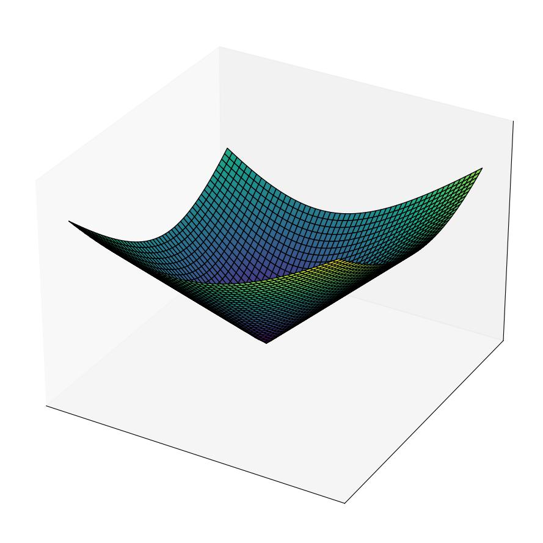
 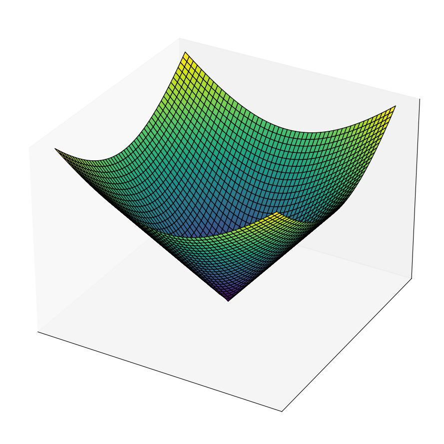
 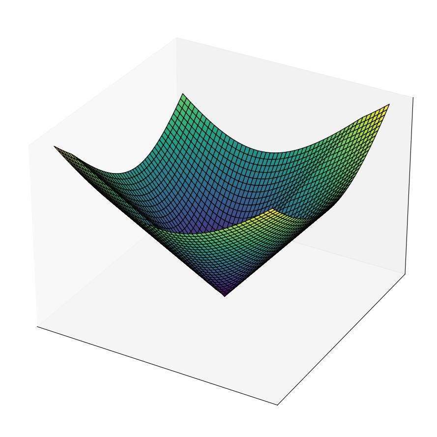
 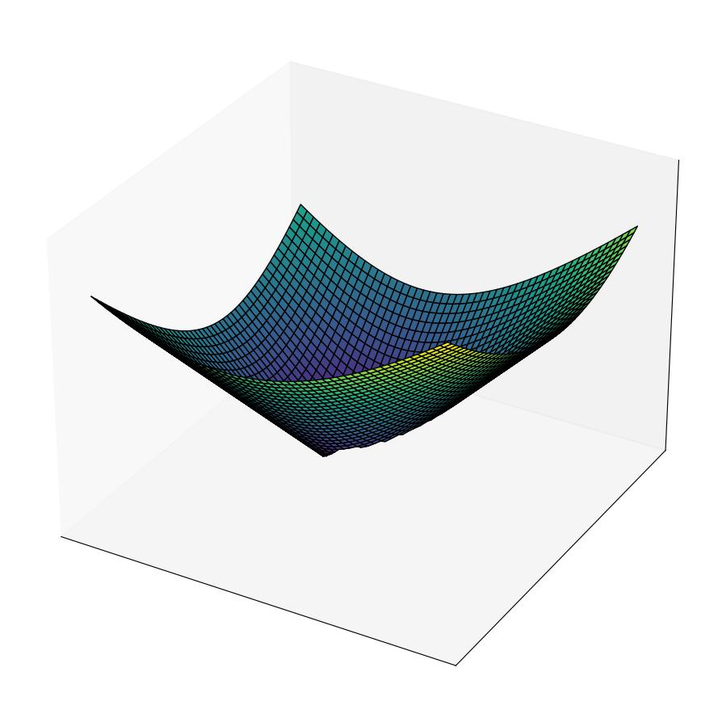
</div>

- Rectangles on a 2D grid: a single rectangle, two rectangles, union of two rectangles, and a cylinder.

<div align="center">
 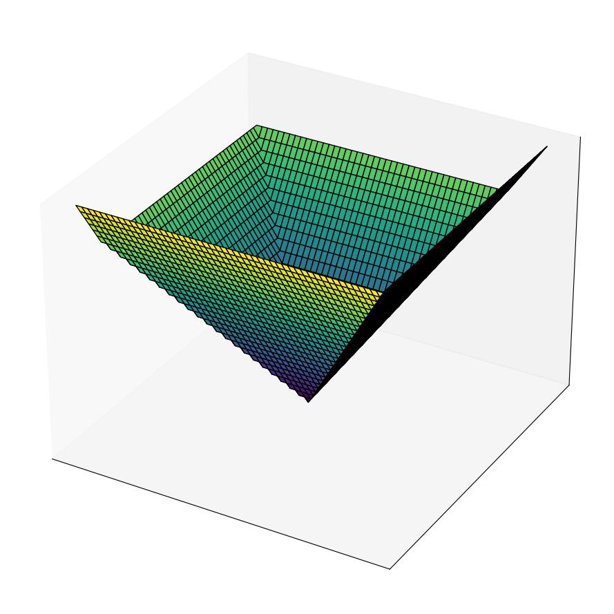
 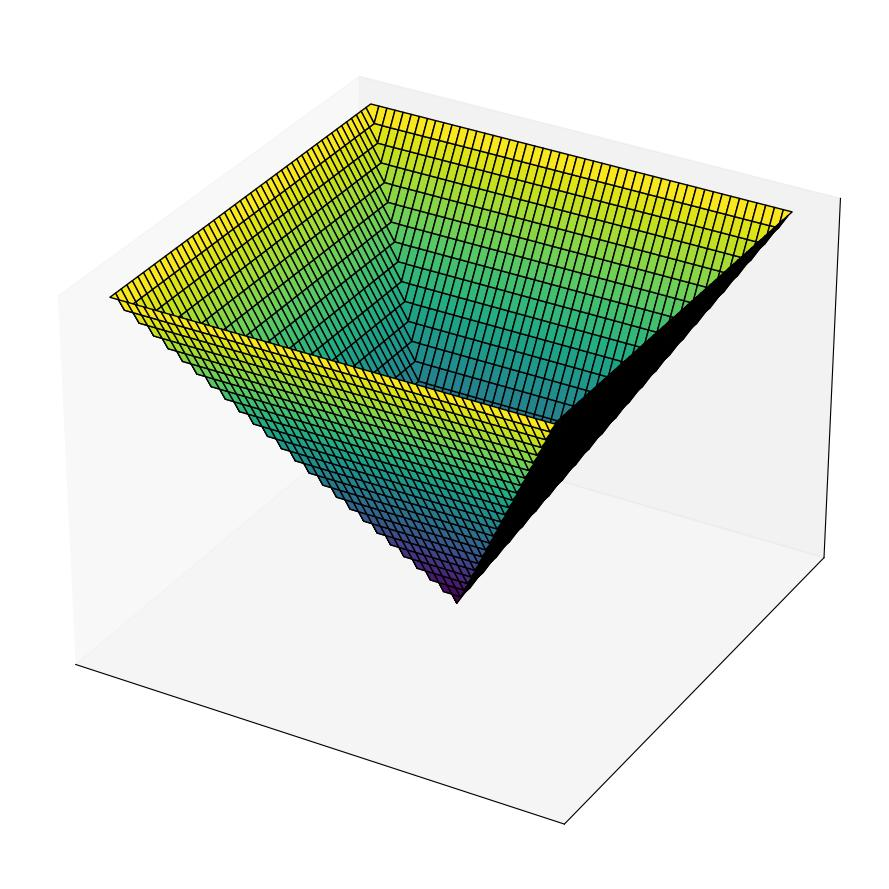
 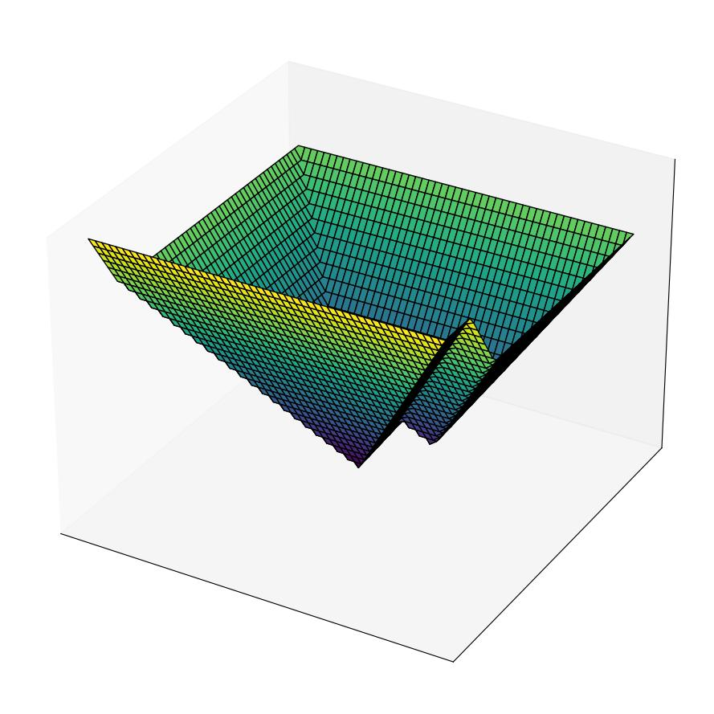
 
</div>


+ 3D Grids

```python
import matplotlib.pyplot as plt
from skimage import measure
from mpl_toolkits.mplot3d.art3d import Poly3DCollection
from mpl_toolkits.mplot3d import Axes3D
import numpy as np

from levelsetpy.grids import createGrid
from levelsetpy.initialconditions import *
from levelsetpy.visualization.mesh_implicit import implicit_mesh

fig = plt.figure(figsize=(16, 9))
def get_grid():

	g3min = -.6*np.ones((3, 1),dtype=np.float64)
	g3max = +6*np.ones((3, 1),dtype=np.float64)
	g3N = 51*np.ones((3, 1),dtype=np.int64)
	g3 = createGrid(g3min, g3max, g3N, process=True)

	return g3

def slender_cylinder(g3):
	axis_align, radius=2, .5
	center = 2*np.ones((3, 1), np.float64)
	cylinder = shapeCylinder(g3, axis_align, center, radius);

	spacing = tuple(g3.dx.flatten().tolist())
	mesh = implicit_mesh(cylinder, level=0., spacing=spacing)

	ax = plt.gca()
	plt.clf()
	ax = fig.add_subplot(121, projection='3d')
	ax.add_collection3d(mesh)

	ax.set_xlabel("x-axis")
	ax.set_ylabel("y-axis")
	ax.set_zlabel("z-axis")

	ax.set_xlim(1.5, 3)
	ax.set_ylim(2.5, 4.0)
	ax.set_zlim(-2, 4.0)

	plt.tight_layout()
	plt.pause(5)

def cylinder_sphere(g3, savedict):
    spacing = tuple(g3.dx.flatten().tolist())

    # generate signed distance function for cylinder
    center = 2*np.ones((3, 1), np.float64)
    ignoreDim, radius=2, 1.5
    cylinder = shapeCylinder(g3, ignoreDim, center, radius);
    cyl_mesh = implicit_mesh(cylinder, level=0., spacing=spacing)

    fig = plt.figure(figsize=(16, 9))
    ax = fig.add_subplot(121, projection='3d')
    #ax.plot3D(g3.xs[0].flatten(), g3.xs[1].flatten(), g3.xs[2].flatten(), color='cyan')
    ax.add_collection3d(cyl_mesh)

    fontdict = {'fontsize':12, 'fontweight':'bold'}
    ax.set_xlabel("X-axis", fontdict = fontdict)
    ax.set_ylabel("Y-axis", fontdict = fontdict)
    ax.set_zlabel("Z-axis", fontdict = fontdict)
    ax.set_title('Zero Level Set: Cylinder', fontdict = fontdict)

    xlim = (min(cylinder[0].ravel()), max(cylinder[0].ravel()))
    ylim = (min(cylinder[1].ravel()), max(cylinder[1].ravel()))
    zlim = (min(cylinder[2].ravel()), max(cylinder[2].ravel()))

    gxlims = (min(g3.vs[0]), max(g3.vs[0]))
    gylims = (min(g3.vs[1]), max(g3.vs[1]))
    gzlims = (min(g3.vs[2]), max(g3.vs[2]))

    ax.set_xlim(xlim[0]-gxlims[0], xlim[1]-gxlims[1])
    ax.set_ylim(ylim[0]-gylims[0], ylim[1]-gylims[1])
    ax.set_zlim(0, zlim[1])

    sphere = shapeSphere(g3, center, radius=3)
    sphere_mesh = implicit_mesh(sphere, level=0., spacing=spacing, edge_color='k', face_color='g')

    ax2 = fig.add_subplot(122, projection='3d')
    #ax2.plot3D(g3.xs[0].flatten(), g3.xs[1].flatten(), g3.xs[2].flatten(), color='cyan')
    ax2.add_collection3d(sphere_mesh)
    ax2.view_init(elev=30., azim=10.)


    xlim = (min(sphere[0].ravel()), max(sphere[0].ravel()))
    ylim = (min(sphere[1].ravel()), max(sphere[1].ravel()))
    zlim = (min(sphere[2].ravel()), max(sphere[2].ravel()))

    gxlims = (min(g3.vs[0]), max(g3.vs[0]))
    gylims = (min(g3.vs[1]), max(g3.vs[1]))
    gzlims = (min(g3.vs[2]), max(g3.vs[2]))

    ax2.set_xlim(xlim[0]-gxlims[0], xlim[1]-gxlims[1])
    ax2.set_ylim(ylim[0]-gylims[0], ylim[1]-gylims[1])
    ax2.set_zlim(0, zlim[1])

    ax2.set_xlabel("X-axis", fontdict = fontdict)
    ax2.set_ylabel("Y-axis", fontdict = fontdict)
    ax2.set_zlabel("Z-axis", fontdict = fontdict)
    ax2.set_title('Zero Level Set: Sphere', fontdict = fontdict)


    plt.tight_layout()
    plt.show()

def main(savedict):
	"""
		Tests the visuals of an implicit function.

		Here, a cylinder generated  by a signed distance function from
		the nodes of a grid. The cylinder is specified by its radius and its
		distance from the center of the grid. This can be used to represent obstacles
		in a state space from which an agent must avoid.
	"""
	plt.ion()

	g3 = get_grid()
	slender_cylinder(g3)
	fig.canvas.draw()
	fig.canvas.flush_events()

	savedict["savename"] = "sphere_cyl.jpeg"
	cylinder_sphere(g3, savedict)
	fig.canvas.draw()
	fig.canvas.flush_events()

	plt.show()
```

- Initial Conditions for a 3D Grid: a sphere, a cylinder, a sphere and a cylinder difference, a sphere and a cylinder union, and a sphere and a an iconosphere.

<div align="center">
 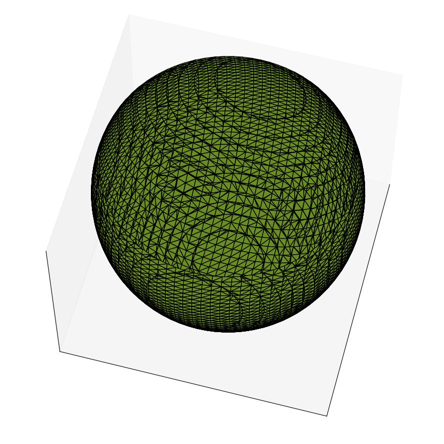
 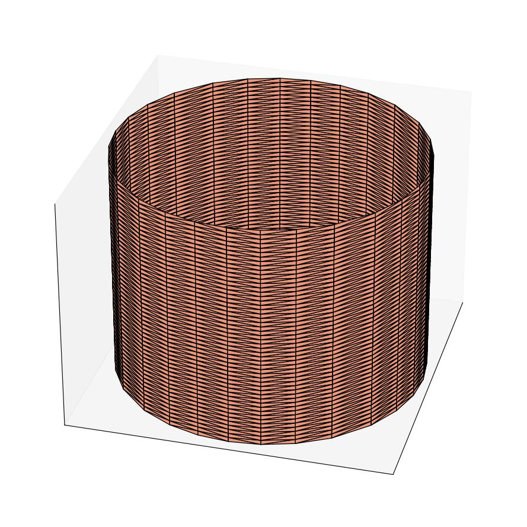
 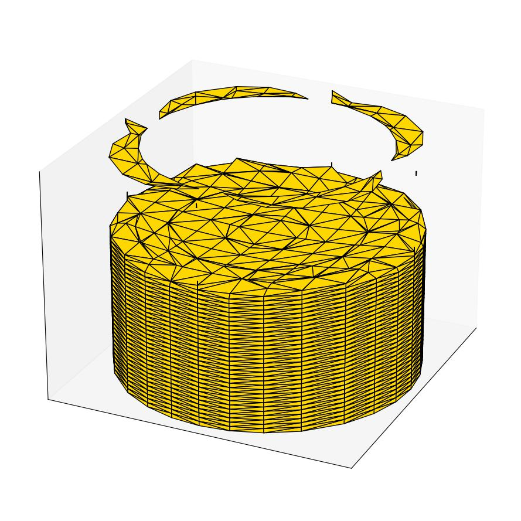
</div>

<div align="center">
 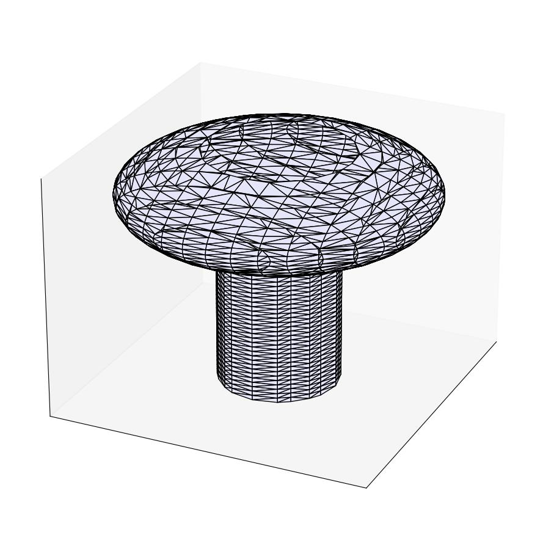
 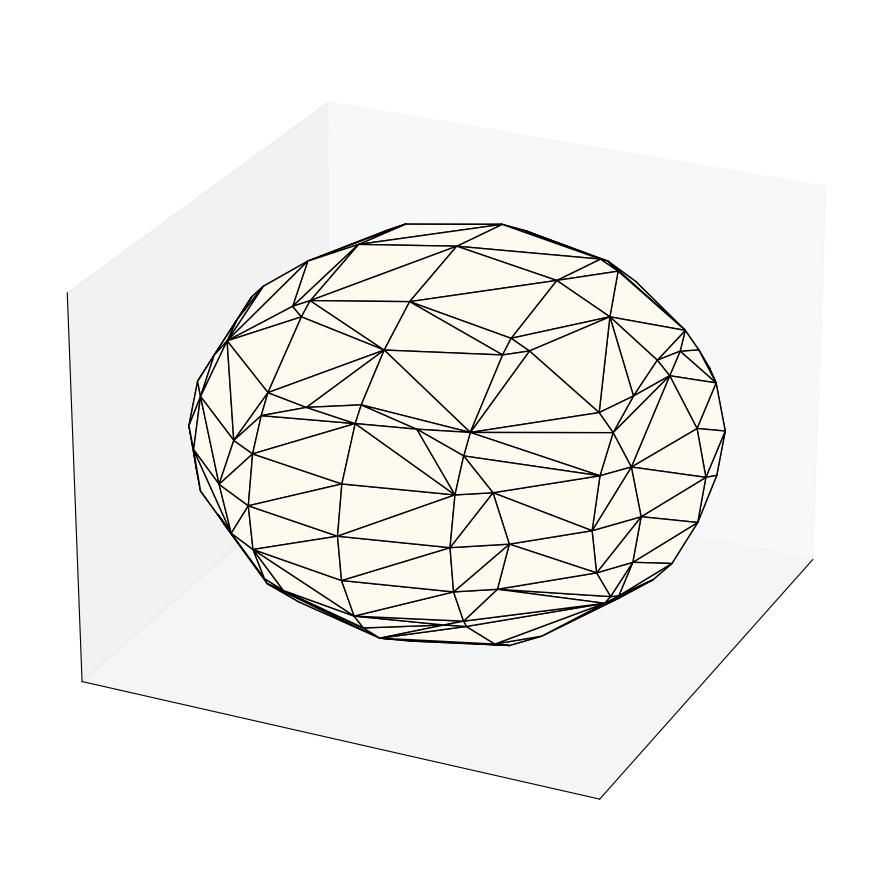
</div>

#### Robustly Controlled Backward Reachable Tubes (RCBRTs)


+ RCBRT of a 2D Rocket System

```bash
python levelsetpy/examples/rocket_ls_example.py
```

- Two rockets on a 2D plane, initial zero level set, and the final RCBRT.

<div align="center">
 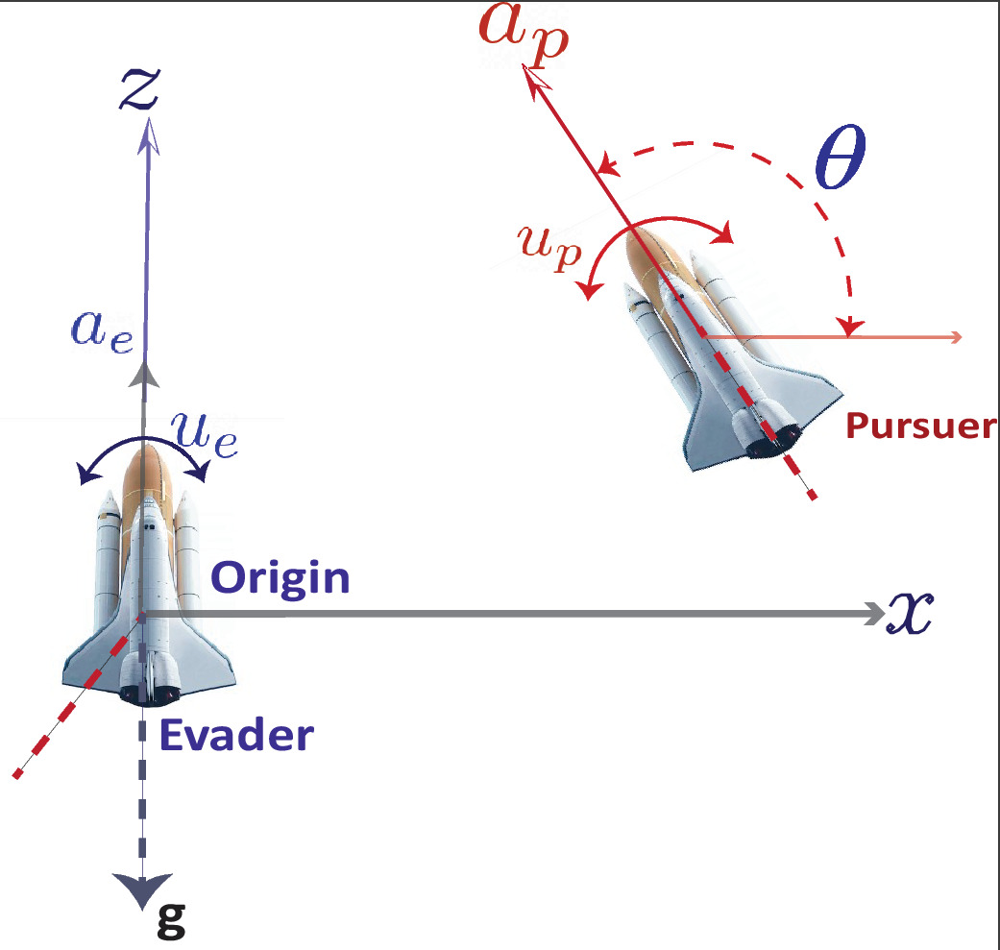
 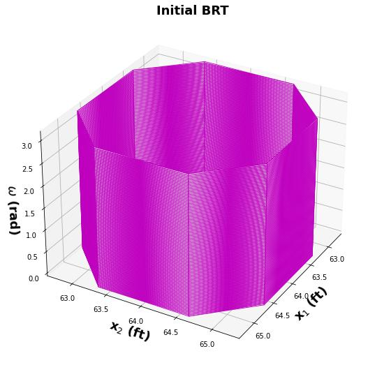
 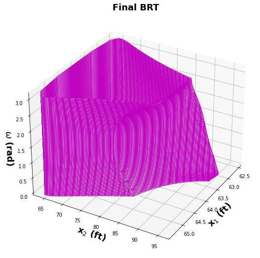
</div>


+ Compute the RCBRT of a Dubins Car System on a Plane

```bash
python levelsetpy/examples/dubins_ls_example.py
```

+ Time to reach the target set for a double integrator on a plane.

```bash
python levelsetpy/examples/dint_basic.py
```

+ Double integrator on a plane: Analytical Time to Reach the Target Set. Switching Curve. Initial Conditions.

<div align="center">
 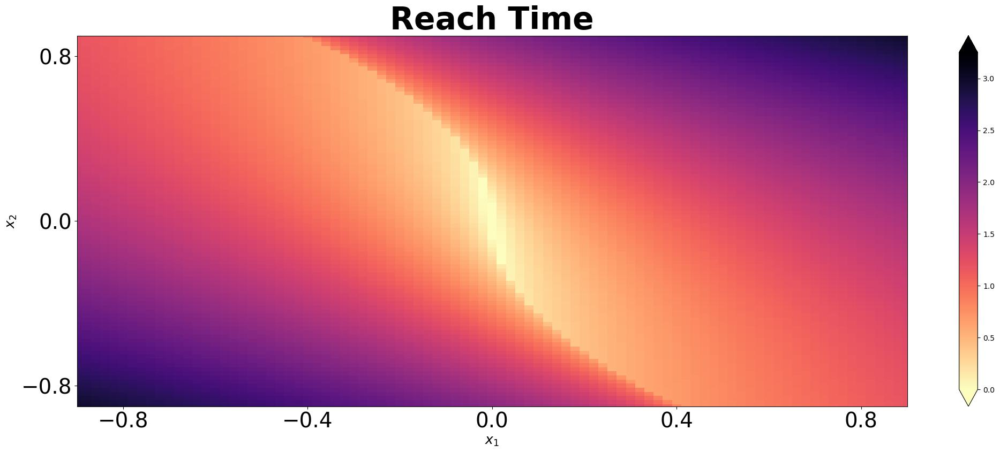
 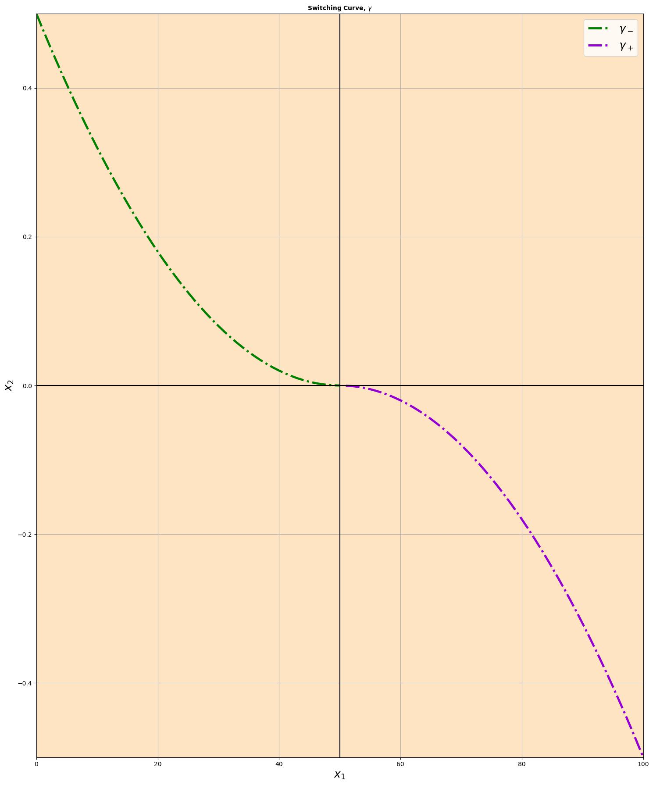
 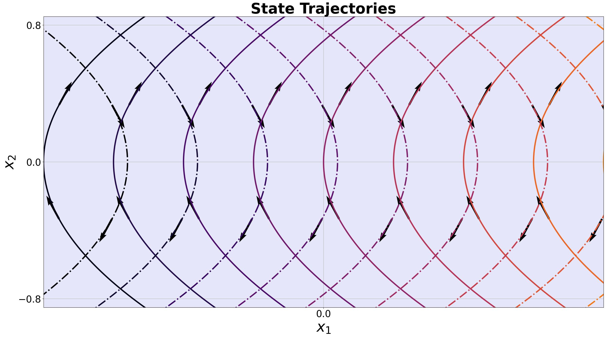
</div>

+ Double integrator on a plane: Isochoner above switching curve. Isochoner below switching curve. Isochoner above and below switching curve. 

<div align="center">
 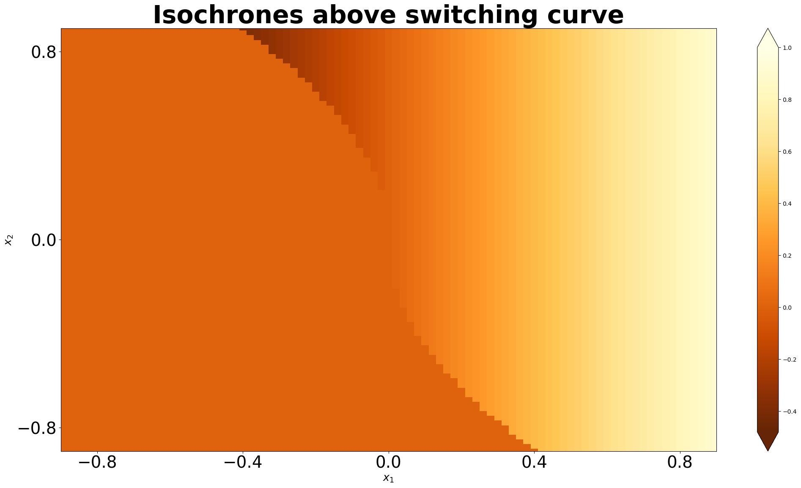
 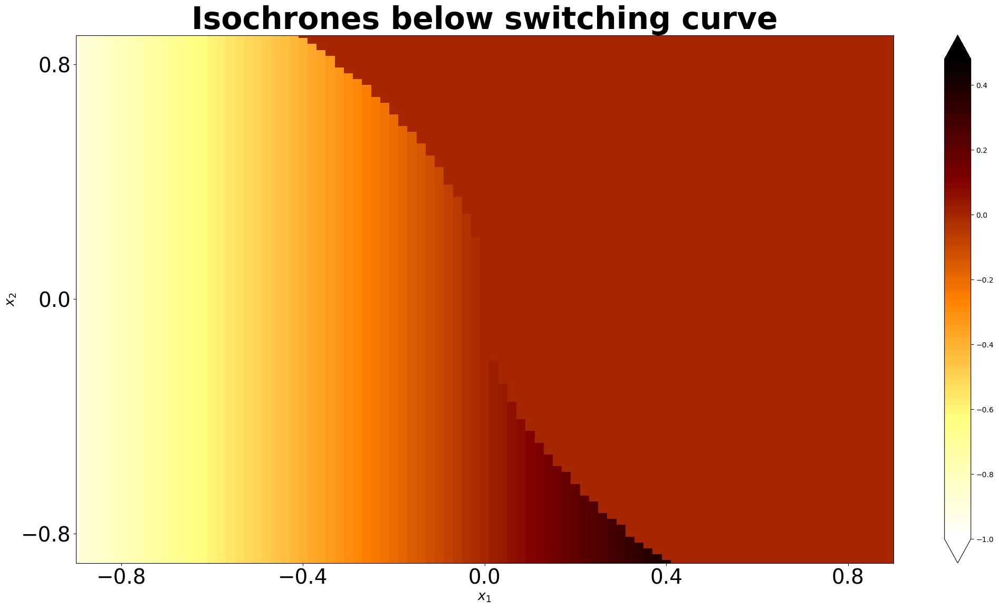
 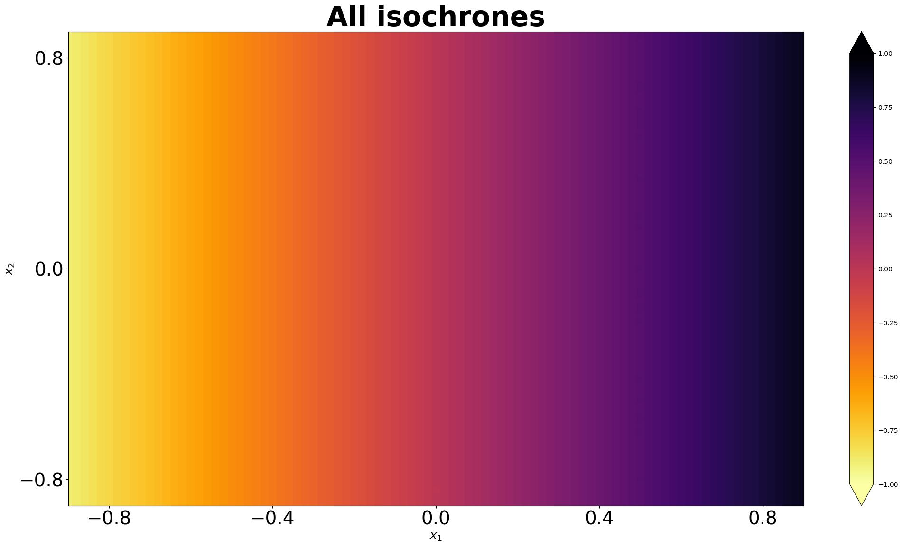
</div>

+ Double integrator trajectories evolution.

<div align="center">
 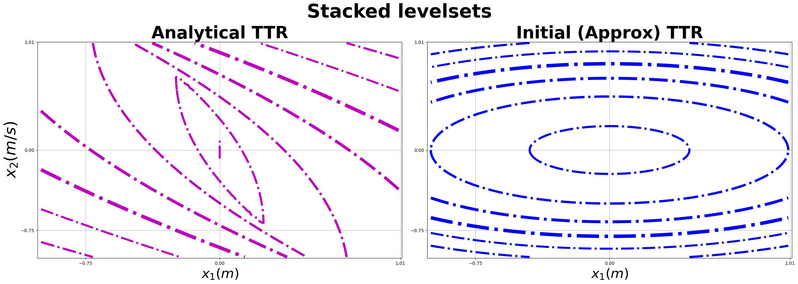
 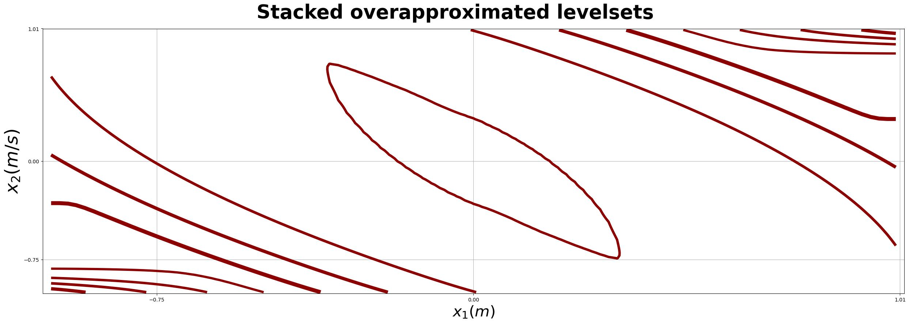
 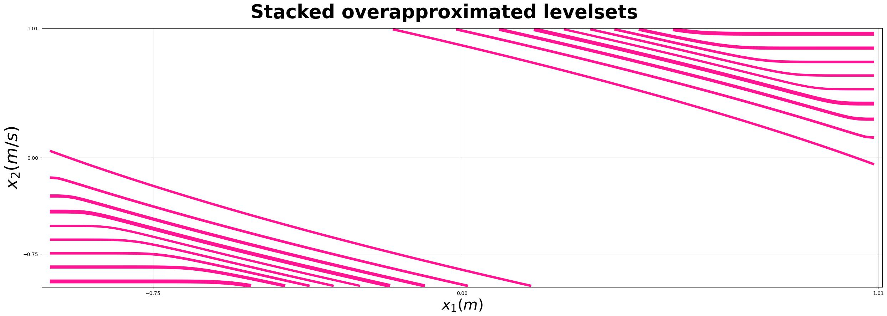
</div>


### Citing this work

If you have found this library of routines and packages useful, please cite it:

```
@article{LevPy,
title   = {LevelSetPy: A GPU-Accelerated Python Software Package for Resolving Hamilton-Jacobi PDEs and Level Set Evolutions},
author  = {Molu, Lekan},
howpublished = {\url{https://github.com/robotsorcerer/LevelSetPy}},
note = {Accessed March 31, 2023}
year    = {2023},
}
```
