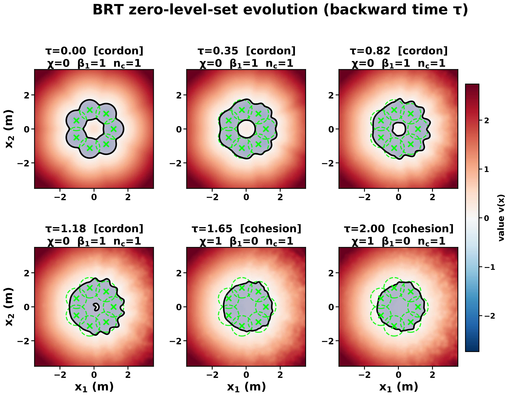
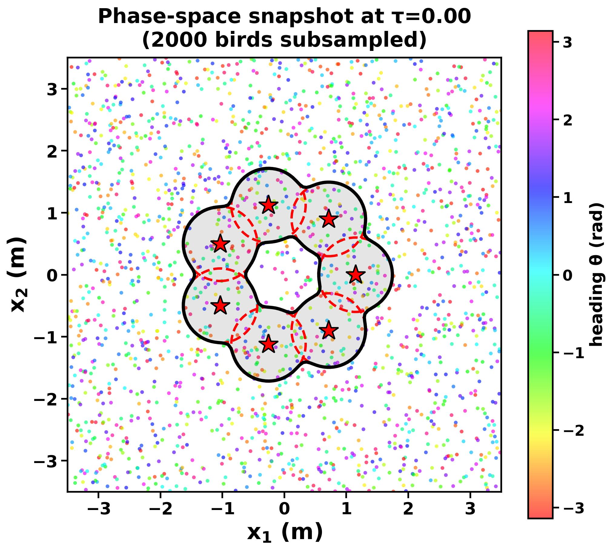
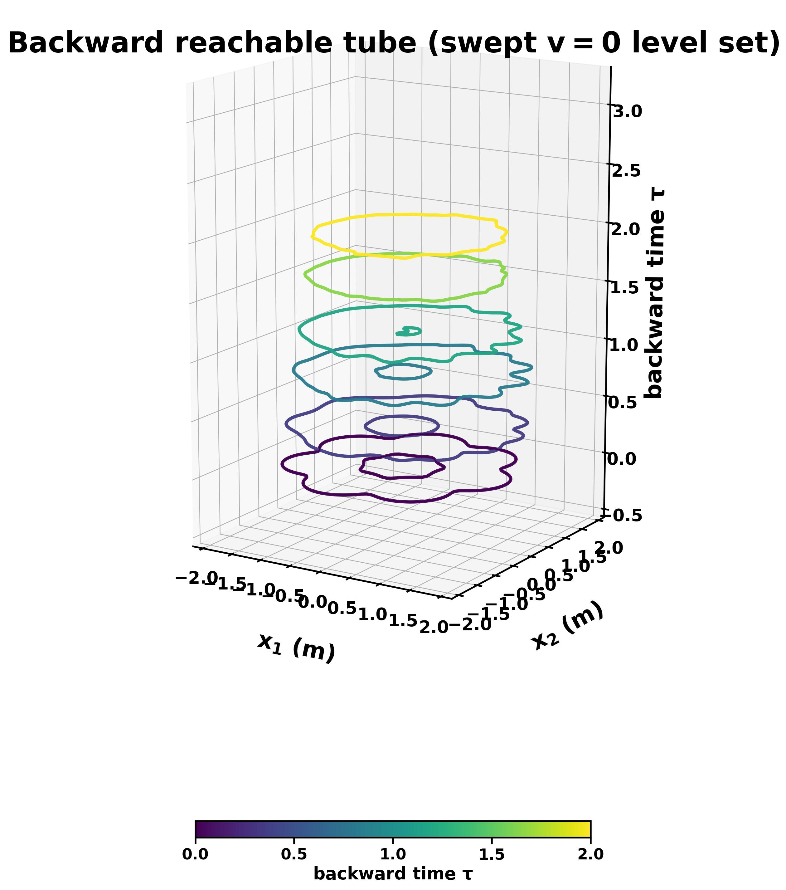
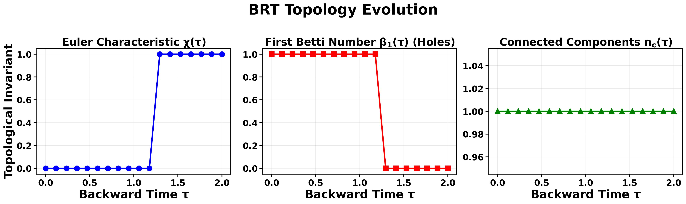
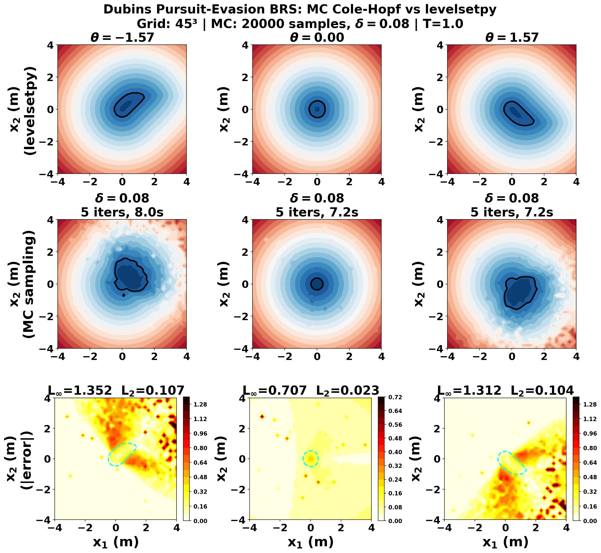

# A Storage‑Free Monte‑Carlo Hamilton–Jacobi Reachability

A grid‑free solver for the viscous Hamilton–Jacobi (HJ) partial differential
equations that arise in safety analysis and reachability of dynamical systems.

## BLUF (Bottom line up front)

The method replaces the exponential‑memory grid of classical level‑set solvers
with a **Gaussian‑expectation (Feynman–Kac) estimator**, giving a memory
footprint of `O(N · n)` in the sample count `N` and state dimension `n` —
independent of any spatial discretization. This is the reference implementation
behind the paper *HJ‑Gauss: A Monte‑Carlo Hamilton–Jacobi Reachability Scheme*
and its headline application, the safety certification of aerial **starling
murmurations** scaled to 100,000+ agents.


- **What?** A grid‑free HJ‑reachability solver: the value function is a
  Gaussian (Feynman–Kac) expectation evaluated by sampling, so memory is
  `O(N · n)` (samples × state dimension) instead of the `O(Mⁿ)` of grid
  level‑set solvers. No grid is ever formed.
- **Baselines:** Reproduces the analytic rocket, Dubins
  two‑car, and double‑integrator barriers to within the worst‑case viscosity
  bound `O(√δ) ≈ 0.28` (e.g. relative `L²` error `< 0.04` at `θ = 0` on the
  Dubins game); see `examples/ex_dubins_3d_comparison.py`.
- **Boundary-pushing:** Certifies a **4‑D, 100,000‑bird** aerial
  murmuration under **7 predators** with the value‑grid solve in **~74 s on
  CPU** and a **87.7 % certified‑safe fraction** — a problem no grid solver can
  hold in memory. Adding agents is free: the value grid cost is independent of
  the population; per‑agent certification is one extra batched forward
  evaluation.
- **It reads out *how* safety is lost, not just *whether*.** The reachable‑tube
  topology `(χ, β₁, n_comp)` recovers, from one computation, defensive **cordon
  formation and its collapse** (`β₁: 1 → 0`), **flock fragmentation** (up to 4
  disjoint safe components), and linear **flash expansion** of the tube radius.
- **It goes high‑dimensional.** A 45‑D, 15‑rocket multi‑pursuer game runs from
  `examples/ex_multiagent_scalability.py`; memory stays linear in `n`.
- **Run it now (CPU, ~1 min):**
  ```bash
  python examples/ex_murmuration.py --device cpu \
      --n-birds 600 --n-flocks 3 --n-predators 1 \
      --n-samples 120 --max-iters 4 --time-steps 8 --grid-res 32 --viz-dir /tmp/murmurations
  ```
- **Reproduce the paper figures:** `make_pub_figures.py` (§6); cached re‑render
  in seconds via `--replot-cache`.
- **Code is live at** <https://github.com/robotsorcerer/levelsetpy>.

### Figures from the paper


| Figure | Caption |
|---|---|
|  | **Backward reachable tube, `τ = 0 → 2`.** A seven‑predator defensive **cordon** (annular safe set, `β₁ = 1`) **collapses** to a simply‑connected set (`β₁ = 0`) as the horizon lengthens. Blue = safe interior, bold black = `v = 0` boundary, green ✕ = predators. *Generated by `make_pub_figures.py --scenario ring`.* |
|  | **Phase‑space snapshot at `τ = 0`.** 2,000 subsampled birds colored by heading `θ`, the seven‑predator ring with capture cylinders (red dashed), and the annular safe set enclosing the protected core. We never render all 100k birds. |
|  | **The reachable set as a swept tube.** `v = 0` contours stacked along the backward‑time axis `τ`; the flower‑shaped annular cross‑section loses its inner hole as the protected pocket closes — the cordon→collapse transition rendered as changing cross‑sectional topology. |
|  | **Topology evolution.** Euler characteristic `χ(τ)`, first Betti number `β₁(τ)`, and connected components `n_c(τ)` versus backward time — the machine‑readable safety signature that flags cordon, collapse, and fragmentation events. |
|  | **Validation against the grid.** MC Cole–Hopf (this code) vs. grid `levelsetpy` on the Dubins pursuit‑evasion game, with pointwise `|error|` maps — agreement within the worst‑case `O(√δ)` viscosity bound. *Generated by `examples/ex_dubins_3d_comparison.py`.* | 

**If you use our results, please consider citing it:**

```
@article{HJGauss,
      title={HJ-Gauss: A Monte-Carlo HJ Reachability Scheme}, 
      author={Molu, Lekan and Renganathan, Venkatraman and Cho, Namhoon},
      year={2026},
      eprint={2605.18566},
      archivePrefix={arXiv},
      primaryClass={eess.SY},
      url={https://arxiv.org/abs/2605.18566}, 
      howpublished = {\url{https://github.com/robotsorcerer/levelsetpy/tree/main/monte_carlo}},
}

> All headline timings above are **CPU‑only** (no GPU required); the code is
> GPU‑compatible for the largest scales. Numbers are reproducible with the fixed
> seeds in the example scripts.

---

## 1. The idea in one paragraph

For the viscous HJ initial‑value problem
`v_t + H(x, ∇v) = (δ/2) Δv`, a **Cole–Hopf transformation** `ω = exp(−c·v)`
linearizes the equation into a heat equation when `H = ½|p|²`. The
Feynman–Kac formula then writes the solution as a Gaussian expectation,
`v(t,x) = −(1/c) · log E_{y ~ N(x, σ²I)}[ exp(−c·g(y)) ]`, with
`σ = √(δ(T−t))`, which we evaluate by Monte‑Carlo sampling. For a **general**
Hamiltonian, a **Picard quasi‑linearization** freezes the gradient magnitude
between iterates, so the nonlinear HJ equation becomes a sequence of linear heat
equations, each solved by the same sampler. The value function **and its
gradient** are recovered from the samples; nothing is ever stored on a grid.

The consequences exploited throughout the code:

- **Storage‑free / grid‑free:** memory is `O(N · n)`, not `O(Mⁿ)`. A 4‑D
  problem that a grid solver cannot hold is routine here.
- **Embarrassingly parallel:** every query point (and every agent) is
  independent, so the estimator shards trivially across cores/GPUs.
- **Explicit error control:** the estimator carries an `O(N^{-1/2})`
  concentration bound; the viscosity floor contributes an `O(√δ)` smoothing
  bias.

---

## 2. Repository layout

```
monte_carlo/
├── README.md                     ← you are here
├── pyproject.toml                ← package metadata + dependencies
├── requirements.txt              ← pinned runtime deps (pip)
├── depends.sh                    ← Miniforge + JAX(CUDA) bootstrap
├── make_pub_figures.py           ← publication‑grade figure pipeline (see §6)
│
├── src/                          ← core solver
│   ├── config.py                 ← SolverConfig (NamedTuple of all knobs)
│   ├── hj_sampler.py             ← HJReachabilitySampler.solve_quasi_linear(...)
│   ├── heat_solver.py            ← Gaussian value/gradient kernels (b17 + autodiff)
│   ├── transforms.py             ← Cole–Hopf forward/inverse
│   ├── topology.py               ← BRT topological signature + phase‑transition detection
│   ├── output_handler.py         ← OutputHandler: all on‑disk figures
│   ├── gpu_distribution.py       ← GPUDistributor (multi‑GPU sharding, CPU fallback)
│   ├── diagnostics.py, initial_conditions.py, hjpde_solver.py
│   └── hamiltonians/             ← quadratic, double_integrator, dubins,
│                                   dubins_relative, rockets_relative, murmuration
│
├── dynamics/                     ← system dynamics
│   ├── murmuration_jax.py        ← 4‑D aerial Dubins agent + FlockState/PredatorState
│   ├── murmuration_torch.py      ← PyTorch port (DDP/torchrun)
│   └── dubins_*, rocket_*        ← benchmark dynamics
│
├── backends/numpy_engine.py      ← pure‑NumPy reference engine
├── examples/                     ← runnable entry points (see §5)
├── tests/                        ← pytest suite (see §7)
├── config/                       ← cfg files (e.g. rockets.cfg)
└── demos/                        ← scratch space
```

---

## 3. Environment & installation

The solver runs on **CPU or GPU**. GPU is needed only for the largest
(million‑agent) scales; everything in this README, including all benchmark and
murmuration figures, runs on a multicore CPU.

### 3a. Quick CPU install (pip + venv)

```bash
python -m venv .venv && source .venv/bin/activate
pip install -U pip
pip install "jax>=0.4" jaxlib numpy scipy scikit-image matplotlib
# optional, only for the PyTorch path:
pip install torch
```

### 3b. GPU install (CUDA)

```bash
# bootstrap Miniforge + a CUDA‑enabled JAX (see depends.sh for the exact steps)
bash depends.sh
# or, directly, matching your CUDA toolkit:
pip install "jax[cuda12]" jaxlib numpy scipy scikit-image matplotlib
```

> **Note on backends.** The JAX path auto‑detects CUDA; if no CUDA‑enabled
> `jaxlib` is present it prints `Falling back to cpu` and runs on CPU. The
> `GPUDistributor` likewise detects available devices and shards across them,
> falling back to a single device when none is found.

### 3c. Editable package install (optional)

```bash
pip install -e ".[dev]"     # installs pytest, black, isort as well
```

Python ≥ 3.11 is required. Core dependencies: `jax`/`jaxlib`, `numpy`, `scipy`,
`scikit-image` (topology), `matplotlib`. The PyTorch examples additionally need
`torch`.

---

## 4. Core API

Everything routes through one object:

```python
from src.config import SolverConfig
from src.hj_sampler import HJReachabilitySampler
from src.gpu_distribution import GPUDistributor

cfg = SolverConfig(
    delta=0.1,            # viscosity; error ~ O(√δ)
    num_samples=1000,     # MC samples per evaluated point (variance ~ 1/√N)
    max_quasi_iters=20,   # Picard quasi‑linearization iterations
    quasi_tol=1e-6,       # convergence tolerance
    t_start=0.0, t_end=1.0,
    gradient_mode="b17",  # "b17" (importance‑weighted) or "autodiff"
    chunk_size=5000,      # points per kernel call (OOM guard)
)
sampler = HJReachabilitySampler(hamiltonian, terminal_cost, cfg, GPUDistributor())
v, history = sampler.solve_quasi_linear(states, t)   # states: (P, n) array
```

`solve_quasi_linear` returns the value at every queried state and the
per‑iteration residual history. The terminal cost `g(x)` is any
JAX‑traceable callable (e.g. a capture cylinder `‖x₁:₂‖ − r`).

See `src/config.py` for the full `SolverConfig` field list and defaults.

---

## 5. Running the experiments

All commands assume the repo root (`monte_carlo/`) as the working directory and
`--device cpu` where applicable.

### 5a. Benchmarks (analytic ground truth)

```bash
python examples/ex_double_integrator.py          # time‑to‑reach, switching curves
python examples/ex_dubins.py                      # Dubins two‑car BRT
python examples/ex_dubins_3d_comparison.py        # Dubins: MC vs levelsetpy + error maps
python examples/ex_rockets.py                      # two‑rocket pursuit‑evasion BRT
python examples/ex_rockets_3d_comparison.py       # rockets: MC vs levelsetpy
python examples/ex_multiagent_scalability.py      # 45‑D, 15‑rocket dimension‑scaling
```

### 5b. Murmurations (the headline application)

```bash
# small smoke test (CPU, ~1 min)
python examples/ex_murmuration.py --device cpu \
    --n-birds 600 --n-flocks 3 --n-predators 1 \
    --n-samples 120 --max-iters 4 --time-steps 8 --grid-res 32 \
    --viz-dir /tmp/murmurations

# topology‑resolving run (cordon → collapse)
python examples/ex_murmuration.py --device cpu \
    --n-birds 8000 --n-flocks 6 --n-predators 7 \
    --delta 0.18 --n-samples 1600 --max-iters 7 \
    --time-steps 18 --grid-res 128 --save-results --viz-dir /tmp/murmurs

# scale demo (100k birds; add --device gpu where available)
python examples/ex_murmuration.py --device cpu \
    --n-birds 100000 --n-flocks 10 --n-predators 7 --save-results
```

Key flags: `--n-birds`, `--n-flocks`, `--n-predators`, `--delta`,
`--n-samples`, `--max-iters`, `--time-steps`, `--grid-res`, `--viz-dir`,
`--out-dir`, `--save-results`, `--save-anim`, `--chunk-size`.

PyTorch (DDP‑capable) port:

```bash
python examples/ex_murmuration_torch.py --n-birds 5000 --n-flocks 2 \
    --n-predators 1 --time-steps 2 --max-iters 3 --n-samples 1000
# multi‑GPU: see examples/run_distributed_demo.sh (torchrun launcher)
```

### 5c. Outputs

Per time step the `OutputHandler` writes (default `dpi=150`):
`trajectory_t{t:04d}.jpg`, `heatmap_t{t:04d}.jpg`,
`phase_diagram_t{t:04d}.jpg`, `reachability_t{t:04d}.jpg`, a single overwritten
`topology_summary.jpg`, and an appended `phase_transitions.txt` event log. With
`--save-results` a `murmuration_summary.pdf` is also produced.

---

## 6. Publication figures (`make_pub_figures.py`)

`make_pub_figures.py` produces the four paper figures from one solve and caches
the value grids so figures can be **restyled without re‑solving**.

```bash
# full solve + render (deterministic seed → reproduces the paper numbers)
python make_pub_figures.py \
    --out-dir /media/lex/data/hjgauss/figures \
    --scenario ring --n-predators 7 --ring-radius 1.15 --r-capture 0.6 \
    --delta 0.18 --n-samples 1600 --max-iters 7 --grid-res 128 \
    --time-steps 18 --n-snapshots 6 --n-birds 7998 --n-flocks 6 \
    --extent 3.5 --smooth-sigma 1.5

# fast re‑render from the cached solve (seconds; for styling tweaks only)
python make_pub_figures.py --out-dir /media/lex/data/hjgauss/figures \
    --replot-cache /media/lex/data/hjgauss/figures/plot_cache.pkl
```

Figures produced: `brt_evolution` (BRT small‑multiples), `brt_tube_3d` (swept
reachable tube), `phase_space_snapshot` (subsampled birds by heading), and
`topology_evolution` (χ, β₁, n_comp). Non‑finite cells from expectation
underflow are masked to a positive sentinel ("far outside the BRT"); the script
warns only when the masked fraction exceeds 5% (low samples / small δ).
Scenarios: `origin` (single cylinder), `ring` (defensive cordon), `spread`
(fragmentation).

---

## 7. Testing

```bash
pip install -e ".[dev]"
pytest -q                                  # full suite
pytest tests/test_murmuration_safety.py    # 7 swarm‑action + correctness tests
python test_murmurations_audit.py          # standalone audit (output handler, etc.)
```

The murmuration test fixture adapts to hardware: it certifies **1,000,000**
birds when a GPU is detected, else **10,000** on CPU.

---

## 8. Configuration reference (`SolverConfig`)

| field | default | controls |
|---|---|---|
| `delta` | 0.1 | viscosity; error `~ O(√δ)` |
| `num_samples` | 1000 | MC samples per point (variance `~ 1/√N`) |
| `max_quasi_iters` | 20 | Picard quasi‑linearization iterations |
| `quasi_tol` | 1e‑6 | convergence threshold |
| `time_steps` | 50 | backward steps / topology frames |
| `t_start`, `t_end` | 0.0, 1.0 | backward horizon `T` |
| `gradient_mode` | `"b17"` | `"b17"` (importance‑weighted) or `"autodiff"` |
| `chunk_size` | 5000 | points per kernel call (OOM guard) |
| `n_flocks`, `n_predators` | 1, 1 | multi‑flock / multi‑predator batch |
| `seed` | 123 | RNG seed |

---

## 9. Deployment notes

- **Scaling the population is free.** The value grid cost is independent of the
  agent count; certifying more agents is one extra batched forward evaluation of
  an already‑computed value function. Push `--n-birds` to stress per‑agent
  certification, not the solve.
- **Scaling the dimension** costs `O(N · n)` memory — linear, not exponential —
  so high‑dimensional games are bounded by sample budget and wall‑clock, never
  by memory.
- **Variance vs. bias.** Raise `--n-samples` to suppress the `O(N^{-1/2})`
  sampling error near the zero level set (where it is largest); lower `--delta`
  to reduce the `O(√δ)` smoothing bias, at the cost of more samples. The robust
  range is `δ ∈ [0.05, 0.2]`.
- **GPU.** Set `--device gpu` (JAX) or use `torchrun` with the PyTorch port for
  multi‑GPU sharding; the `GPUDistributor` handles device placement and CPU
  fallback automatically.

---

## 10. Citation

If you use this code, please cite the HJ‑Gauss paper (see the project's paper
directory for the current BibTeX entry).

> Detailed development notes, scientific planning documents, and the PyTorch
> implementation write‑up that accompanied this code during paper development
> have been archived under `research_assistant/` in the paper repository.
